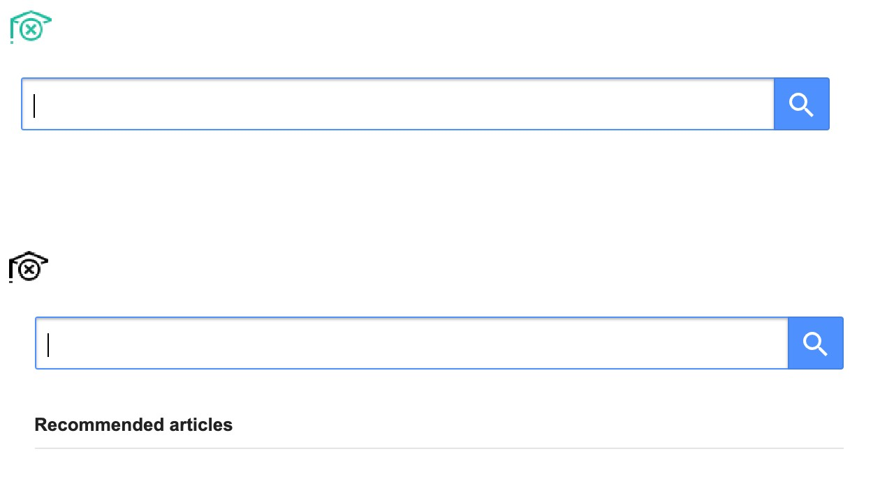

# HideScholarReco

This Chrome extension allows you to hide Google Scholar recommendations.

## How To Run

Go to `chrome://extensions` and specify the repo directory
using the `Load Unpacked` option.

We are currently working on including this in the Chrome Web Store.

## Sample

## Whom to Contact?

All relevant questions can be directed to [gpavanb1](https://github.com/gpavanb1)